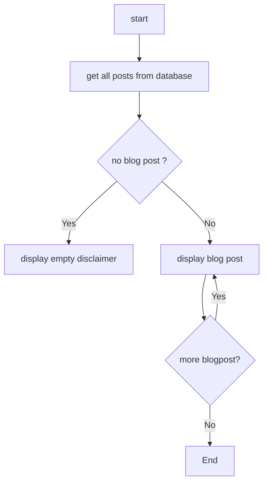
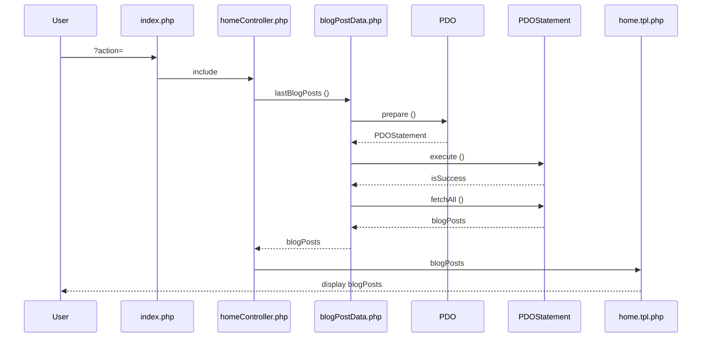
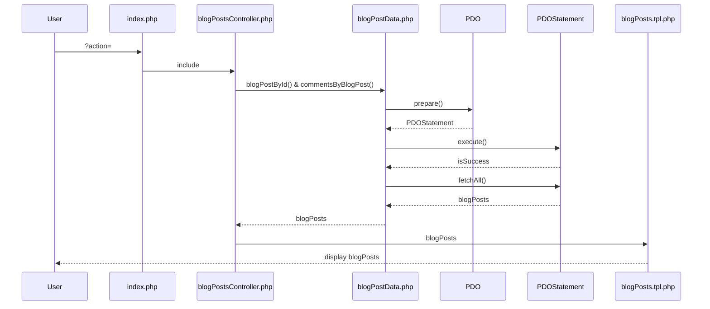

## Diagramme conditions posts

```mermaid
graph TD
    A[start] --> B[get all posts from database]
    B --> C{no blog post ?}
    C -- Yes --> D[display empty disclaimer]
    C -- No --> E[display blog post]
    E --> F{more blogpost?}
    F -- Yes --> E
    F -- No --> G[End]
```
## Diagramme structure blog

```mermaid
sequenceDiagram
    User ->>index.php: ?action=
    index.php->>homeController.php: include
    homeController.php->>blogPostData.php: lastBlogPosts ()
    blogPostData.php->>PDO: prepare ()
    PDO-->>blogPostData.php: PDOStatement
    blogPostData.php->>PDOStatement: execute ()
    PDOStatement -->>blogPostData.php: isSuccess
    blogPostData.php->>PDOStatement: fetchAll ()
    PDOStatement-->>blogPostData.php: blogPosts
    blogPostData.php-->>homeController.php: blogPosts
    homeController.php->>home.tpl.php: blogPosts
    home.tpl.php-->>User: display blogPosts
```

## Afficher un article

```mermaid
sequenceDiagram
    User->>index.php: ?action=
    index.php->>blogPostsController.php: include
    blogPostsController.php->>blogPostData.php: blogPostById() & commentsByBlogPost()
    blogPostData.php->>PDO: prepare()
    PDO-->>blogPostData.php: PDOStatement
    blogPostData.php->>PDOStatement: execute()
    PDOStatement-->>blogPostData.php: isSuccess
    blogPostData.php->>PDOStatement: fetchAll()
    PDOStatement-->>blogPostData.php: blogPosts
    blogPostData.php-->>blogPostsController.php: blogPosts
    blogPostsController.php->>blogPosts.tpl.php: blogPosts
    blogPosts.tpl.php-->>User: display blogPosts
```